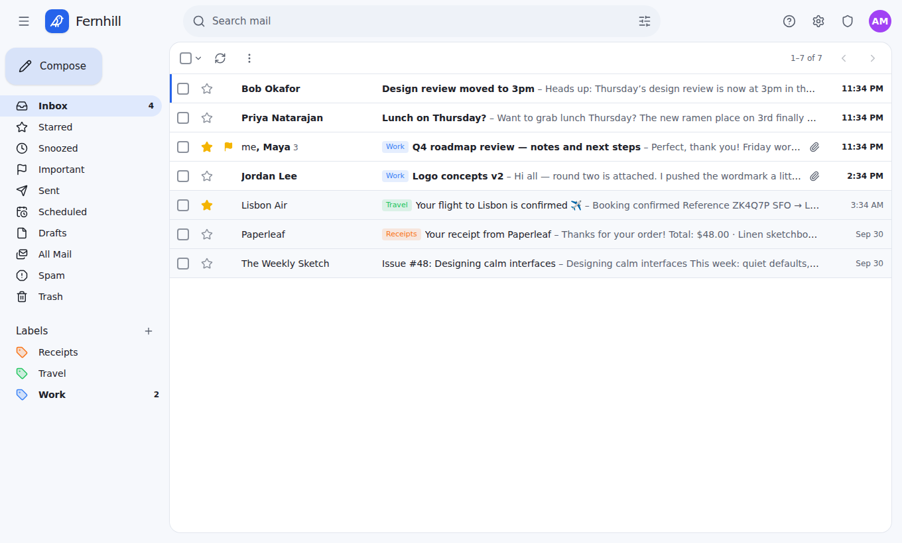
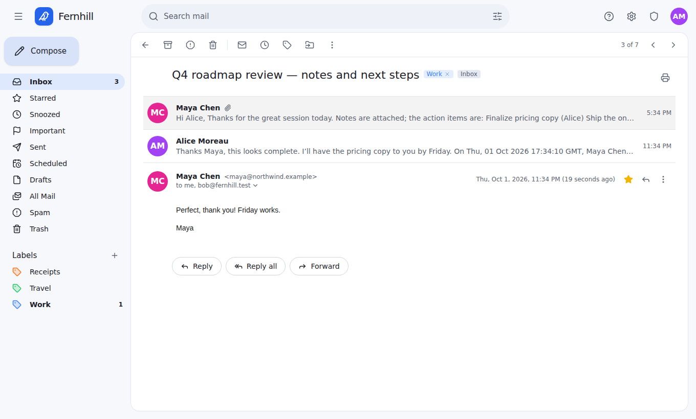
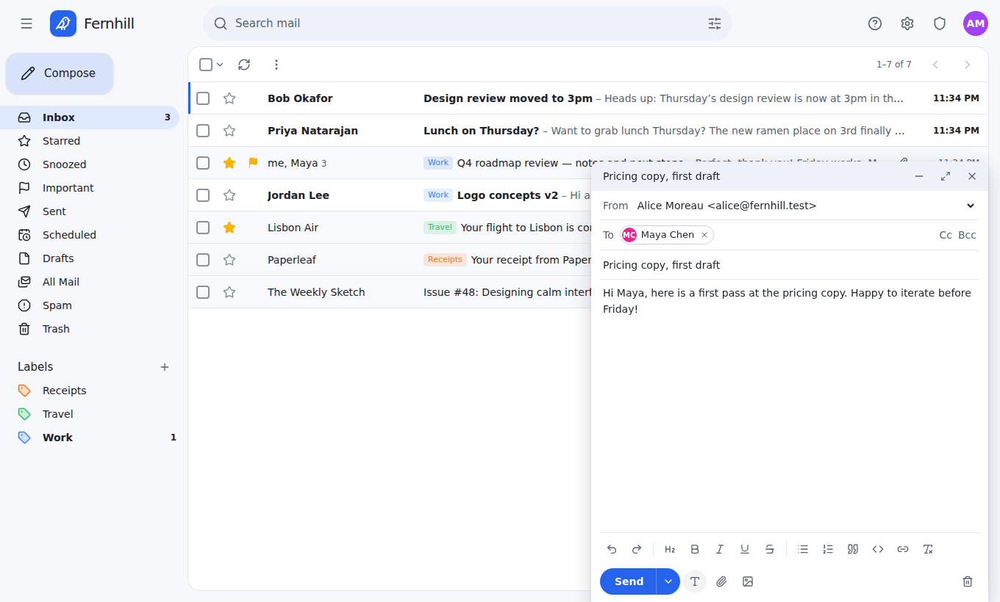
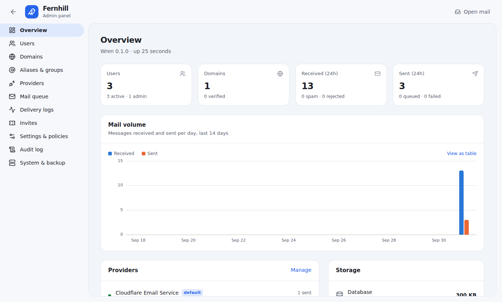
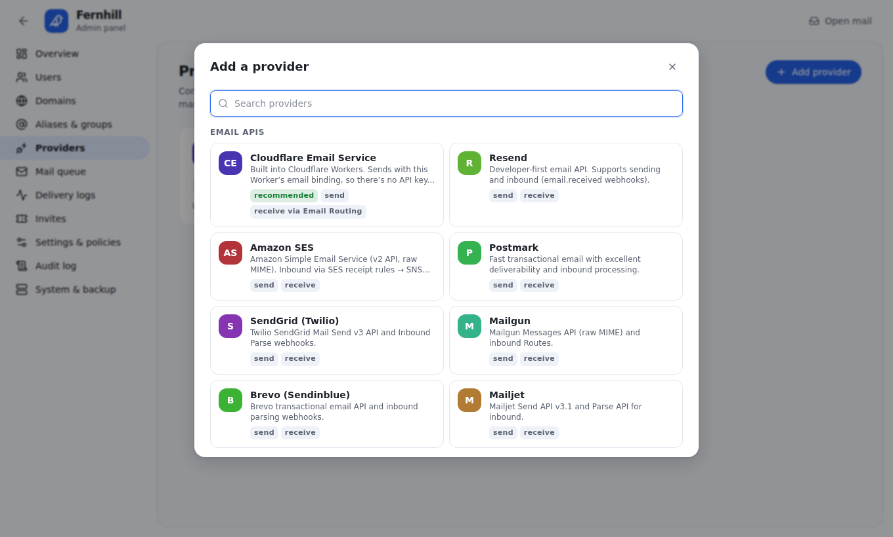

<p align="center">
  
</p>

<h1 align="center">Wren</h1>
<p align="center"><b>Your mail, on your domains.</b><br>
A clean, Gmail-style webmail that runs entirely on <b>Cloudflare Workers</b>, with no servers and no Docker.<br>
Send with Cloudflare Email Service (no API key) or Resend, and receive with Email Routing.</p>

<p align="center"><a href="https://deploy.workers.cloudflare.com/?url=https://github.com/genisis-lab/mail"></a></p>

<p align="center"></p>

## Why Wren

- **Custom domains, any number.** Mailboxes, aliases, distribution groups, catch-alls,
  plus-addressing (`you+tag@`), and external forwarding.
- **Built around Cloudflare.** One Worker plus a SQLite Durable Object, R2, Email Routing
  (incoming mail) and Email Service (outgoing mail through the Worker's own binding, with no API key).
  There's no VM, no open ports, no TLS certificates and no secrets to set up.
- **Or bring your provider.** Resend, Amazon SES, Postmark, SendGrid, Mailgun, Brevo, Mailjet,
  SparkPost, MailerSend, MailChannels, SMTP2GO, ZeptoMail, Elastic Email, Mailtrap, Scaleway,
  Postal, SMTP relays (Gmail, Microsoft 365, Fastmail…) and more, with a fallback provider per
  domain. See [docs/providers.md](docs/providers.md).
- **Feels like Gmail.** Conversations, labels, stars, snooze, undo send, scheduled send,
  search operators, keyboard shortcuts, a floating compose window, inline replies, and dark mode.
- **A real admin panel.** Users, quotas, domains with DNS health checks, providers with
  test sends, the mail queue, delivery logs, policies, invites, audit log, and backups.

| Conversation | Compose |
|---|---|
|  |  |
| **Admin overview** | **20+ providers** |
|  |  |

## Quick start

Click **Deploy to Cloudflare** above, or from a terminal:

```bash
git clone https://github.com/genisis-lab/mail wren && cd wren
npm install
npm run setup        # signs in to Cloudflare, creates the R2 bucket, deploys
```

Then:

1. Open the printed URL and finish the setup wizard. Choose **Cloudflare Email Service** (no
   API key) or **Resend** (paste your key).
2. In the Cloudflare dashboard, open your domain → **Email → Email Routing**, enable it, and
   set the catch-all rule to **Send to a Worker → wren**. That's how mail comes in.
3. Using Cloudflare Email Service? Open **Email Service → Email Sending** and onboard your
   domain so Wren can send from it.

Full guide: **[docs/cloudflare.md](docs/cloudflare.md)**.

### How mail flows

| | Cloudflare Email Service | Resend |
|---|---|---|
| **Sending** | The Worker's `send_email` binding, no API key | Resend API key |
| **Receiving** | Email Routing → the Worker's `email()` handler | Email Routing, or Resend's inbound webhook |
| **Setup** | Onboard the domain in Email Sending | Verify the domain in Resend |

Everything runs inside the Worker: the web app, the API, the send queue (Durable Object
alarms), search, and storage (SQLite in a Durable Object, files in R2).

### Optional: self-hosting

You don't need Docker. If you'd rather run Wren on your own server, the same Worker runs
locally on workerd, Cloudflare's open-source Workers runtime: `npm run serve`, or
`docker compose up -d`. Send and receive through a provider such as Resend, because Email
Routing and Email Service need a Cloudflare deployment. See
[docs/self-hosting.md](docs/self-hosting.md).

## Features

**Mail.** Threaded conversations. Inbox, Starred, Snoozed, Important, Sent, Scheduled,
Drafts, All Mail, Spam and Trash. Coloured labels, bulk actions ("select all 2,341"),
archive, snooze, undo send (0–30 s), scheduled send, draft autosave,
attachments and inline images, rich-text editing, signatures, reply/reply-all/forward
inline or popped out, contact autocomplete, a sandboxed HTML renderer with remote-image
blocking, and view original / download `.eml`.

**Search.** Full text (SQLite FTS5) plus `from:` `to:` `cc:` `subject:` `label:`
`has:attachment` `filename:` `is:unread|starred|important|snoozed`
`in:inbox|sent|spam|trash|anywhere` `before:` `after:` `older_than:` `newer_than:`
`larger:` `smaller:`, "exact phrases" and `-negation`. Includes an advanced search form
and "create filter from search".

**Settings.** Theme, density, page size, default From, signature, vacation responder
(dates, contacts only, one reply per sender per 4 days), forwarding, filters (label,
archive, star, forward, delete, never/always spam), blocked senders, labels, password,
TOTP 2FA with recovery codes, active sessions, and API keys.

**Admin.**
- Dashboard with volume chart and provider health.
- Users: roles, suspend, quotas, daily send limits, password and 2FA reset, sign out everywhere.
- Domains: DNS checklist and checker, provider and fallback, catch-all, DKIM selectors.
- Aliases and groups.
- Providers: verify credentials, send test email, rotate inbound URLs.
- Mail queue with retry and cancel; inbound and outbound delivery logs.
- Invites; registration policy (closed, invite, open).
- Security policies: required 2FA, password length, session length, lockout.
- Limits; spam settings (built-in scoring or rspamd) and a server-wide blocklist; retention.
- Branding; announcement emails; audit log.
- Backups: portable export and restore, plus point-in-time recovery on Cloudflare.

**Security.**
- Passwords hashed with scrypt; TOTP 2FA.
- Provider secrets encrypted with AES-256-GCM.
- HttpOnly SameSite cookies plus a CSRF header.
- Login rate limiting and an audit trail.
- CSP, and sandboxed message rendering with no scripts.

**Developer API.** `POST /api/v1/send` with `Authorization: Bearer wren_…`.

**Desktop mail apps.** Wren is a web app (it works on phones too). Workers can't accept
incoming SMTP or IMAP connections, so Outlook and Apple Mail can't connect to it directly.

## Architecture

```
src/
  web/        React 19 + Vite + Tailwind single-page app (Workers static assets)
  server/     Hono API, mail engine and provider adapters
    platform.ts   storage, DNS, sockets and scheduling interfaces
  worker/     Worker entry: Durable Object (SQLite), R2, Email Routing, Email Service,
              alarms, cron, TCP sockets
scripts/      setup.mjs (terminal setup), serve.mjs (optional self-hosting on workerd)
```

The design notes are in [docs/PLAN.md](docs/PLAN.md).

## Development

```bash
npm install
npm run dev         # the Worker on the real Workers runtime (workerd) at http://localhost:8787
npm run dev:web     # optional: hot-reloading UI at http://localhost:5173 (API proxied to 8787)
npm test            # vitest: MIME, SMTP client, providers, mail flow, backups, HTTP API
npm run typecheck
```

In `npm run dev`, Cloudflare Email Service sends are simulated (written to `.wrangler/tmp`),
and you can deliver a test message to the `email()` handler:

```bash
curl -X POST 'http://localhost:8787/cdn-cgi/handler/email?from=alice@example.org&to=you@example.com' \
  --data-binary @message.eml
```

## License

MIT
