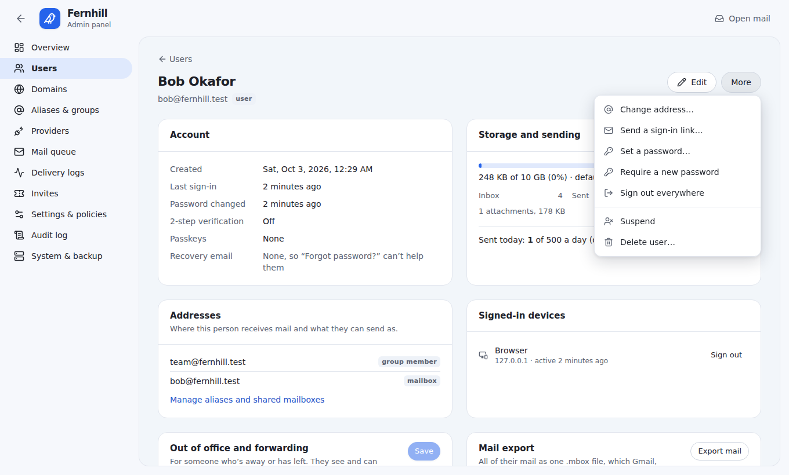
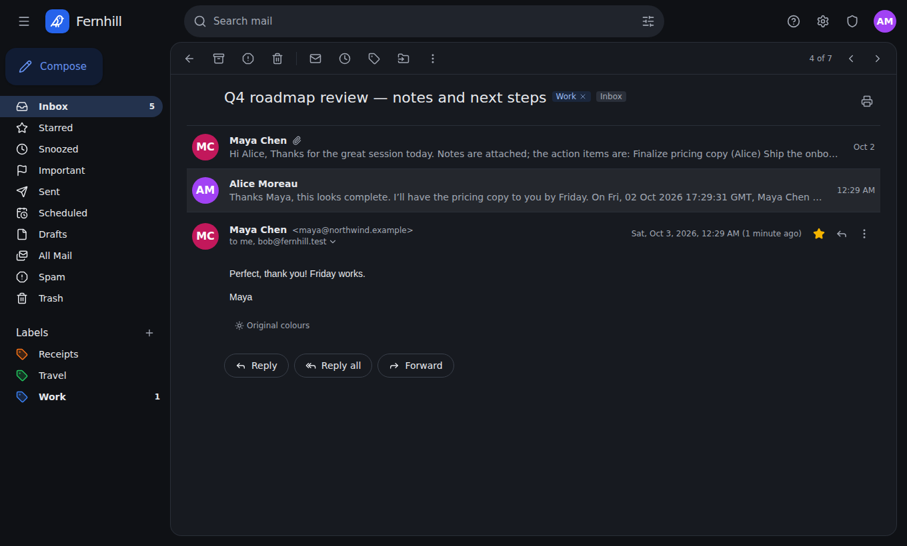
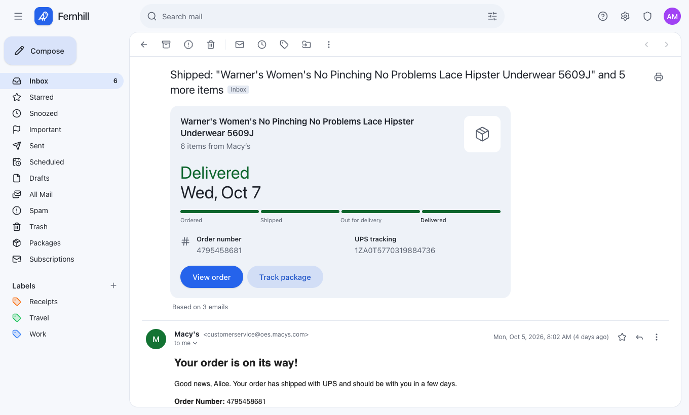
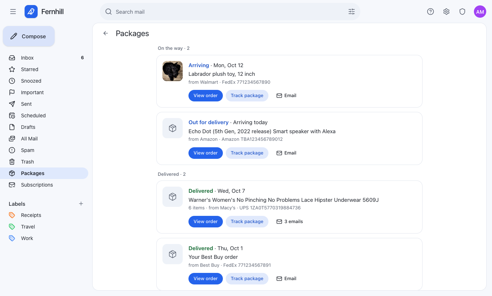
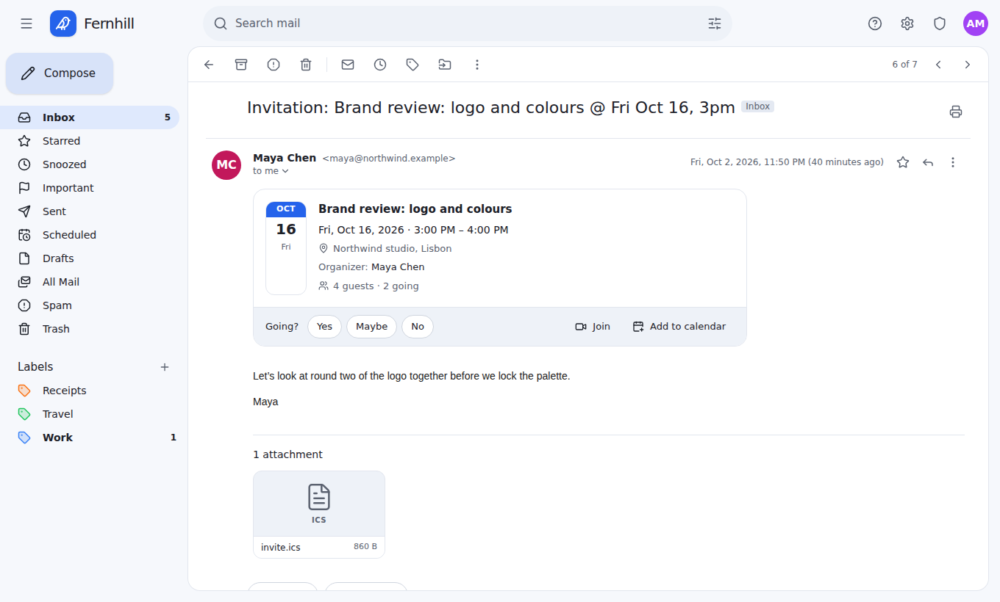
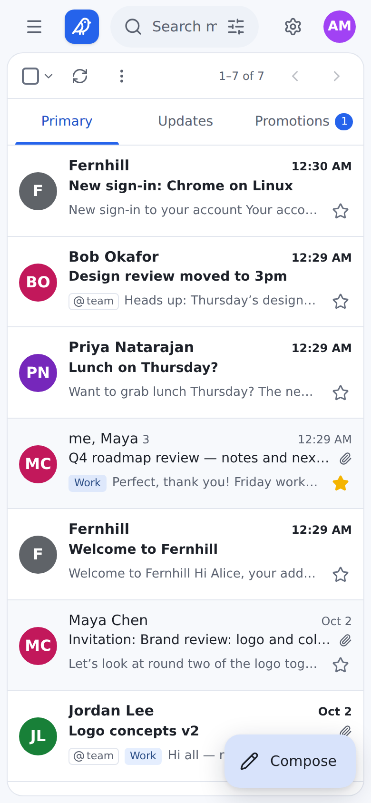

<p align="center">
  
</p>

<h1 align="center">Wren</h1>
<p align="center"><b>Your mail, on your domains.</b><br>
A clean, Gmail-style webmail that runs entirely on <b>Cloudflare Workers</b>, with no servers and no Docker.<br>
Send with Cloudflare Email Service (no API key) or Resend, and receive with Email Routing.</p>

<p align="center"><a href="https://deploy.workers.cloudflare.com/?url=https://github.com/genisis-lab/mail"></a></p>

<p align="center"></p>

## Why Wren

- **Custom domains, any number.** Mailboxes, aliases, distribution groups, catch-alls,
  plus-addressing (`you+tag@`), and external forwarding.
- **Built around Cloudflare.** One Worker plus a SQLite Durable Object, R2, Email Routing
  (incoming mail) and Email Service (outgoing mail through the Worker's own binding, with no API key).
  There's no VM, no open ports, no TLS certificates and no secrets to set up.
- **Or bring your provider.** Resend, Amazon SES, Postmark, SendGrid, Mailgun, Brevo, Mailjet,
  SparkPost, MailerSend, MailChannels, SMTP2GO, ZeptoMail, Elastic Email, Mailtrap, Scaleway,
  Postal, SMTP relays (Gmail, Microsoft 365, Fastmail…) and more, with a fallback provider per
  domain. See [docs/providers.md](docs/providers.md).
- **Feels like Gmail.** Conversations, labels, stars, snooze, undo send, scheduled send,
  Primary / Updates / Promotions tabs, one-click unsubscribe, meeting invitations you can
  answer, package tracking cards with View order (into the shop's app on your phone), a
  Packages page, Manage subscriptions, pictures loaded through an image proxy so senders
  can't see your IP address, attachment previews, search operators, keyboard shortcuts, a floating compose
  window, inline replies, a "did you mean to attach files?" check, and a dark mode that
  turns ordinary emails dark while newsletters keep their own colours.
- **A real admin panel.** Users, quotas, domains with DNS health checks, providers with
  test sends, the mail queue, delivery logs with bounces and a suppression list (from every
  provider), catch-all control, policies, invites, audit log, and daily backups to R2.
  Change someone's address, require a new password, unlock an account, and handle
  someone leaving: out-of-office, forwarding, a mail export, and their addresses passed on.

| Conversation | Compose |
|---|---|
|  |  |
| **Admin overview** | **20+ providers** |
|  |  |
| **Managing people** | **Dark mode** |
|  |  |
| **Package tracking** | **Packages** |
|  |  |
| **Meeting invitations** | **On your phone** |
|  |  |

## Quick start

Click **Deploy to Cloudflare** above, or from a terminal:

```bash
git clone https://github.com/genisis-lab/mail wren && cd wren
npm install
npm run setup        # signs in to Cloudflare, creates the R2 bucket, deploys
```

Then:

1. Open the printed URL and finish the setup wizard. Choose **Cloudflare Email Service** (no
   API key) or **Resend** (paste your key).
2. In the Cloudflare dashboard, open your domain → **Email → Email Routing**, enable it, and
   set the catch-all rule to **Send to a Worker → wren**. That's how mail comes in.
3. Using Cloudflare Email Service? Open **Email Service → Email Sending** and onboard your
   domain so Wren can send from it.

Full guide: **[docs/cloudflare.md](docs/cloudflare.md)**.

### How mail flows

| | Cloudflare Email Service | Resend |
|---|---|---|
| **Sending** | The Worker's `send_email` binding, no API key | Resend API key |
| **Receiving** | Email Routing → the Worker's `email()` handler | Email Routing, or Resend's inbound webhook |
| **Setup** | Onboard the domain in Email Sending | Verify the domain in Resend |

Everything runs inside the Worker: the web app, the API, the send queue (Durable Object
alarms), search, and storage (SQLite in a Durable Object, files in R2).

### Optional: self-hosting

You don't need Docker. If you'd rather run Wren on your own server, the same Worker runs
locally on workerd, Cloudflare's open-source Workers runtime: `npm run serve`, or
`docker compose up -d`. Send and receive through a provider such as Resend, because Email
Routing and Email Service need a Cloudflare deployment. See
[docs/self-hosting.md](docs/self-hosting.md).

## Features

**Mail.** Threaded conversations. Inbox, Starred, Snoozed, Important, Sent, Scheduled,
Drafts, All Mail, Spam and Trash. Coloured labels, bulk actions ("select all 2,341"),
archive, snooze, undo send (0–30 s), scheduled send, draft autosave,
attachments and inline images, rich-text editing, signatures, reply/reply-all/forward
inline or popped out, contact autocomplete, a sandboxed HTML renderer with remote-image
blocking (pictures you choose to show load through Wren's image proxy, so the sender never
sees your IP address or device), and view original / download `.eml`. Before sending, Wren asks "Did you mean
to attach files?" if what you wrote says "see attached" (or "enclosed", "PFA"…) and
nothing is attached. Saved replies, saved searches in the
sidebar, a signature per address, and shared mailboxes (support@, sales@) that a team
reads together, with "sent by" on each reply.

**Conversation tools.** **Sign-in codes** ("980708 is your code") show as a one-tap
Copy button on the inbox row, at the top of the message and in the notification, and
those emails stay in Primary. **Remind me if no reply**: after you send, pick tomorrow,
3 days, a week or a date; if nobody has answered by then, your message comes back to the
top of the inbox marked "No reply", with Follow up and Done. **Mute** a noisy
conversation so new replies skip the inbox. **Merge** conversations that should be one.
**Contact groups** ("Roadmap crew") that you type in To like a person and that expand
into everyone in them.

**Packages.** Shipping mail shows a card at the top of the conversation, like Gmail's:
the item and the shop, where the package is ("Delivered · Tue, Oct 6", "Arriving
tomorrow"), the order and tracking numbers, **View order** (the shop's own order page,
which opens in the shop's app on a phone that has it: Amazon, Walmart, Macy's, Target,
Best Buy and more) and **Track package** (UPS, USPS, FedEx, DHL, Amazon and other
carriers). Every email about the same package (the order confirmation, the shipping
email, a forwarder's or the carrier's delivery notice) makes one card, matched by
tracking or order number. Wren reads the order markup shops add for Gmail, carrier
tracking links, and tracking numbers it can check by their check digit. Inbox rows show
where each package is, the **Packages** page lists everything on its way and what
arrived lately, notifications lead with "Out for delivery · Amazon", and `has:package`
finds every shipping email. Links only go to the sender's, the shop's or the carrier's
own site.

**Phishing protection.** Report phishing from a message's menu: it moves the sender's
mail to Spam and tells your admin. Mail claiming to be from your own domain that didn't
come from Wren and failed SPF, DKIM and DMARC shows a red "Be careful" warning.

**Inbox tabs.** Primary, Updates (receipts, alerts, notifications, discussion lists) and
Promotions (newsletters, offers), with unread counts. Mail written by a person always
stays in Primary; move a conversation to another tab and that sender's mail follows.
Can be turned off. **Unsubscribe** sits next to the sender of mailing-list mail: Wren
uses the list's one-click unsubscribe (RFC 8058), or emails the list's unsubscribe
address from the address it mails, or opens the list's page. **Manage subscriptions**
lists every newsletter and mailing list you got mail from in the last six months, the
busiest first, with Unsubscribe and View emails.

**Which address it came to.** Mail that reached you through an alias, a group, a
sign-up address or the catch-all shows a small "@hello" chip; click it to see
everything sent there (`deliveredto:`). Turn an alias off from the message menu or
Settings → Accounts, and mail to it bounces. **Sign-up addresses** (like
`shoe-shop.k3x9@yourdomain`): one per site, with how much mail each received, so a
leaked one is easy to spot and switch off.

**Dark mode.** Ordinary emails (replies, notes, personal mail) take the dark theme,
with text colours meant for white paper made readable. Designed emails such as
newsletters and receipts keep a white background so logos and brand colours survive.
Every message has a switch to flip it.

**Meeting invitations.** Invitations from Google Calendar, Outlook, Apple Calendar and
others show as an event card: the time in your zone (and the organizer's), place,
guests, Join, Add to calendar, and Yes / Maybe / No, which sends a proper calendar reply
to the organizer.

**Attachment previews.** Images, PDFs, text files, audio and video open in a viewer with
previous / next, download and open in a new tab.

**On your phone.** Installable as an app (PWA) with its own icon. New-mail
notifications through Web Push. Pushes carry no data: the app asks Wren what's new, so
nothing about your mail passes through the push service. Gmail-style rows with swipe
actions, pull down to refresh, press and hold to select, a floating Compose button, and
the unread count in the tab title and app badge.

**Offline.** Mail you've opened recently (your inbox and up to 150 conversations) stays
readable with no connection. Mail you send while offline waits on the device and goes
out when you're back online; if the server refuses it, it's saved to Drafts. Signing
out clears what was saved on the device.

**Moving in and out.** Import from Gmail (a Google Takeout `.mbox` keeps labels, stars
and read state), from any IMAP account (Gmail, iCloud, Yahoo, Fastmail, Zoho…; copied in
the background, password forgotten when done), or any `.mbox` file. Messages already
there are skipped. Export everything as one `.mbox` that imports back as it was.
Contacts import from Google/Outlook CSV or vCard and export to both.

**Search.** Full text (SQLite FTS5) plus `from:` `to:` `cc:` `subject:` `label:`
`has:attachment` `has:package` `filename:` `is:unread|starred|important|snoozed`
`in:inbox|sent|spam|trash|anywhere` `before:` `after:` `older_than:` `newer_than:`
`larger:` `smaller:` `deliveredto:` `category:primary|updates|promotions`,
"exact phrases" and `-negation`. Includes an advanced search form and "create filter
from search".

**Settings.** Theme, density, page size, default From, signatures, vacation responder
(dates, contacts only, one reply per sender per 4 days), forwarding, filters (label,
archive, star, forward, delete, never/always spam), blocked senders, labels, swipe
actions, notifications, inbox tabs, self-service aliases and sign-up addresses (if the
admin allows), password, a recovery email for "Forgot password?", passkeys, TOTP 2FA
with recovery codes, sign-in alerts, active sessions, and API keys.

**Admin.**
- Dashboard with volume chart, provider health, and a "Get Wren ready" checklist built
  from real state, including a round-trip test that sends a message out through your
  provider and waits for it to come back.
- Alerts when a provider keeps failing, the send queue backs up, a mailbox is nearly
  full, or DNS changes for the worse (checked daily). They go to admins' inboxes, push
  for critical ones, and optionally an outside address.
- Users: roles, suspend, quotas, daily send limits, 2FA and passkey reset, sign out
  everywhere; bulk actions; CSV import with a dry-run check and CSV export; a detail page
  with storage, addresses, devices and sign-in history. New people get an emailed link to
  choose their own password, and an optional welcome message.
  - **Change someone's address** (their sign-in name) on any hosted domain, keeping the
    old one as an alias if you like; they get a note in their inbox.
  - **Require a new password** at next sign-in, with a temporary password, for one person
    or in bulk. **Unlock** an account that too many wrong passwords locked.
  - **When someone is away or leaves:** set their out-of-office reply and forwarding,
    export their mail as `.mbox`, and on delete pass their addresses and catch-alls to
    someone else so nothing bounces.
  - Only the owner can change, sign out or reset the owner account.
- Domains: DNS records that match the sending provider, a DNS checker with health
  badges, provider and fallback, catch-all, DKIM selectors, and one-click Cloudflare
  setup (Email Routing and Email Sending). It won't move a domain's mail away from its
  current MX without asking. Catch-all activity lists the addresses the catch-all has
  been taking, so you can block one or make it a real alias. A sending-only subdomain
  (say `contact.example.com`) needs no MX, takes its DMARC from the parent domain, and
  shows whether your provider has it verified.
- Aliases, groups and shared mailboxes.
- Providers: verify credentials, send test email, rotate inbound URLs.
- Mail queue with retry and cancel; delivery logs with search, filters, a timeline and
  retry. Logs show headers only; admins never see message bodies.
- Delivery status from every provider: bounces, spam complaints, delays and deliveries,
  from each provider's event webhook (Resend, SES, Postmark, SendGrid, Mailgun, Brevo,
  Mailjet, SparkPost, MailerSend and more) or from bounce emails (SMTP relays, Cloudflare
  Email Service). Addresses that hard-bounce or complain go on a suppression list and
  aren't mailed again until removed. See [docs/providers.md](docs/providers.md).
- Invites, emailed for you; registration policy (closed, invite, open).
- Security policies: required 2FA, password length, session length, lockout.
- Limits; spam settings (built-in scoring or rspamd) and a server-wide blocklist; retention.
- System emails (invites, password links, alerts) from the address you choose, plain
  and personal so they stay out of spam; invites reply to the admin who sent them.
- Branding; announcement emails; audit log.
- Backups: a daily backup of the database to R2 (keep the last 7, or as many as you
  like; an alert if one fails), back up now, download, restore; portable export and
  restore; point-in-time recovery on Cloudflare.

**Security.**
- Passwords hashed with scrypt; passkeys (WebAuthn); TOTP 2FA.
- An email when your account is signed in to from a new device.
- Provider secrets encrypted with AES-256-GCM.
- HttpOnly SameSite cookies plus a CSRF header.
- Login rate limiting and an audit trail.
- CSP, and sandboxed message rendering with no scripts.
- Pictures in mail load through an image proxy: only links Wren signed, only images,
  never private addresses.

**Developer API.** `POST /api/v1/send` with `Authorization: Bearer wren_…`.

**Accessibility.** Labelled controls, dialogs that keep and return focus, menus with
arrow keys, announced notifications, and colours that meet WCAG AA contrast.

**Desktop mail apps.** Wren is a web app, installable on phones and desktops. Workers
can't accept incoming SMTP or IMAP connections, so Outlook and Apple Mail can't connect
to it directly.

## Architecture

```
src/
  web/        React 19 + Vite + Tailwind single-page app (Workers static assets)
  server/     Hono API, mail engine and provider adapters
    platform.ts   storage, DNS, sockets and scheduling interfaces
  worker/     Worker entry: Durable Object (SQLite), R2, Email Routing, Email Service,
              alarms, cron, TCP sockets, and the image proxy (/api/img/, served by the
              Worker itself, without the Durable Object)
scripts/      setup.mjs (terminal setup), serve.mjs (optional self-hosting on workerd)
```

The design notes are in [docs/PLAN.md](docs/PLAN.md).

## Development

```bash
npm install
npm run dev         # the Worker on the real Workers runtime (workerd) at http://localhost:8787
npm run dev:web     # optional: hot-reloading UI at http://localhost:5173 (API proxied to 8787)
npm test            # vitest: MIME, SMTP client, every provider, mail flow, passkeys, backups, HTTP API
npm run typecheck
```

In `npm run dev`, Cloudflare Email Service sends are simulated (written to `.wrangler/tmp`),
and you can deliver a test message to the `email()` handler:

```bash
curl -X POST 'http://localhost:8787/cdn-cgi/handler/email?from=alice@example.org&to=you@example.com' \
  --data-binary @message.eml
```

## License

MIT
